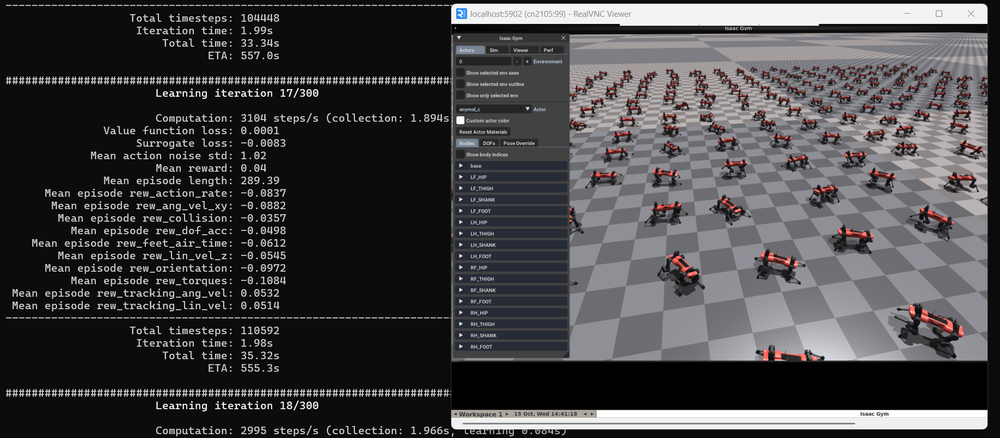

# Motivation

(This is the only section written by me, rest is by Claude 4.5 Sonnet)

I was used to running Isaac Gym on RTX 4090 and now when I have access to a cluster, I really wanted access to the GUI to play the policies. I know it can be recorded and viewed but I have spent a lot of time zooming and panning live to see what is wrong with my robot. I wasted a lot of time to set this up, so I hope this is useful to someone. Just share this repo to your LLM and then it should take care from there for your specific case.


*Legged Gym training ANYmal robots on UMN MSI cluster, viewed live via VNC*

# Isaac Gym on UMN MSI with VNC GUI

A working example of running NVIDIA Isaac Gym Preview 4 with GUI on UMN MSI cluster using Apptainer/Singularity.

## The Problem

**Scenario:** You want to run Isaac Gym with GUI on an HPC cluster that:
- Uses Rocky Linux on compute nodes
- Doesn't allow sudo access
- Has NVIDIA GPUs but no physical display

**Challenge:** Isaac Gym requires Vulkan for rendering. When the host OS (Rocky Linux) differs from the container OS (Ubuntu), the standard `--nv` flag doesn't properly bind NVIDIA/Vulkan libraries, causing segmentation faults.

## The Solution

This repository provides a working setup for UMN MSI that solves:
1. **OS mismatch:** Rocky Linux host → Ubuntu container
2. **Library paths:** Rocky uses `/usr/lib64/`, Ubuntu uses `/usr/lib/x86_64-linux-gnu/`
3. **Vulkan configuration:** Proper JSON file binding for GPU rendering
4. **No display:** VNC server for remote GUI access

## Prerequisites

- Access to UMN MSI cluster
- Isaac Gym Preview 4 downloaded to `~/isaacgym/`
- VNC viewer on your local machine (RealVNC, TigerVNC, etc.)

## Usage

### Step 1: Build Container (one-time, ~15 minutes)
```bash
# Request GPU node with sufficient RAM for building
srun --time=02:00:00 -p v100 --gres=gpu:v100:1 --mem=64gb --cpus-per-task=8 --pty bash

# Setup build environment
export APPTAINER_CACHEDIR=$HOME/apptainer_cache
export APPTAINER_TMPDIR=$HOME/apptainer_tmp
mkdir -p $APPTAINER_CACHEDIR $APPTAINER_TMPDIR

# Load CUDA and build
module load cuda/11.8.0-gcc-7.2.0-xqzqlf2
cd apptainer/
chmod +x build_container.sh
./build_container.sh
```

### Step 2: Run Isaac Gym with GUI
```bash
chmod +x run_isaac_gym_vnc.sh
./run_isaac_gym_vnc.sh
```

Note which compute node it's running on (e.g., `cn2105`).

### Step 3: Connect via VNC

**On your local machine:**
```bash
# Create SSH tunnel (replace cn2105 with your compute node)
ssh -L 5900:cn2105:5900 your_username@agate.msi.umn.edu
```

**Open VNC Viewer and connect to:** `localhost:5900`

You should see Isaac Gym with 36 humanoid robots!

## What's Inside

- **`apptainer/isaac_gym.def`** - Container definition with all dependencies
- **`apptainer/build_container.sh`** - Simple build script
- **`run_isaac_gym_vnc.sh`** - Runtime script with library binding and VNC setup

## Key Technical Details

### Why Selective Library Binding?

Rocky Linux stores NVIDIA libraries in `/usr/lib64/`, but Ubuntu containers expect them in `/usr/lib/x86_64-linux-gnu/`. We bind only GPU-related libraries to avoid conflicts with system libraries (like glibc).

### Why These Specific Libraries?

The Vulkan JSON files reference specific libraries:
- `libGLX_nvidia.so.0` - Vulkan rendering
- `libEGL_nvidia.so.0` - EGL (offscreen rendering)
- `libnvidia-present.so.*` - Present layer

We bind these and their dependencies.

### Why VNC Instead of X11 Forwarding?

X11 forwarding doesn't work well with GPU-accelerated applications. VNC creates a virtual display (Xvfb) that Isaac Gym can render to, and we stream it to your local machine.

## Adapting to Other Clusters

This is a **reference implementation for UMN MSI**. If you're on a different cluster:

1. **Check your host OS:** `cat /etc/os-release`
2. **Find NVIDIA libraries:** `ls /usr/lib64/libnvidia-* || ls /usr/lib/x86_64-linux-gnu/libnvidia-*`
3. **Check Vulkan files exist:** `ls /usr/share/vulkan/icd.d/nvidia_icd*.json`
4. **Modify paths in `run_isaac_gym_vnc.sh`** accordingly

The inline comments in the scripts explain what each part does and why.

## Environment Tested

- **Cluster:** University of Minnesota MSI
- **Host OS:** Rocky Linux 8
- **GPU:** NVIDIA Tesla V100
- **Driver:** 580.82.07
- **Container OS:** Ubuntu 20.04
- **CUDA:** 11.8
- **Isaac Gym:** Preview 4

## Using with Legged Gym

If you want to use this setup with Legged Gym for training legged robots:

### 1. Clone Required Repositories
```bash
cd ~
git clone https://github.com/leggedrobotics/legged_gym.git
git clone https://github.com/leggedrobotics/rsl_rl.git
cd rsl_rl && git checkout v1.0.2 && cd ~
```

### 2. Install Dependencies (One-Time)

The first time you run, the script will automatically install:
- `rsl_rl` (PPO implementation)
- `legged_gym` (locomotion environments)

### 3. Run Training

Use the provided script: [examples/run_legged_gym.sh](examples/run_legged_gym.sh)
```bash
chmod +x examples/run_legged_gym.sh
./examples/run_legged_gym.sh
```

The script will print the SSH tunnel command with the correct compute node:
```bash
ssh -L 5900:cn2XXX:5900 your_username@agate.msi.umn.edu
```

Then connect your VNC viewer to `localhost:5900` to see the training live!

### 4. Modify and Experiment

Edit code directly on MSI:
```bash
vim ~/legged_gym/legged_gym/envs/base/legged_robot.py
```

Changes are immediately visible on the next run - no container rebuild or reinstall needed!


## Acknowledgments

This solution was inspired by [AlexandreBrown/Maniskill3-Singularity-Example](https://github.com/AlexandreBrown/Maniskill3-Singularity-Example), which documented the OS mismatch problem and selective library binding approach.


